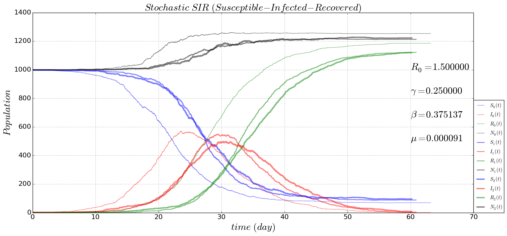

# stochastic-evolution
Evolutionary insights provided by stochastic ways
### [one strain SIR epidemiological evolution](https://github.com/alvason/stochastic-evolution/blob/master/code/stochastic_SIR.ipynb)

