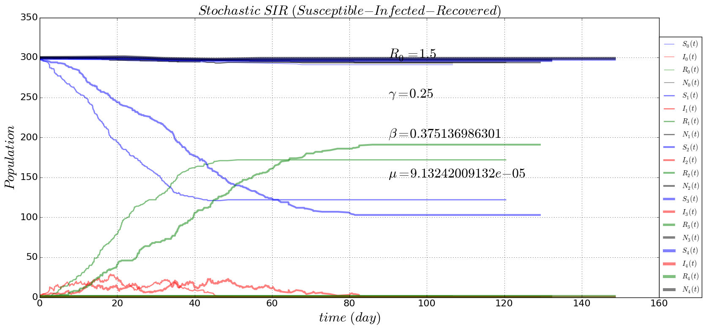

# stochastic-epidemiological models
Stochastic version for evolutionary insights
### [one strain SIR epidemiological evolution](https://github.com/alvason/stochastic-evolution/blob/master/code/stochastic_SIR.ipynb)

